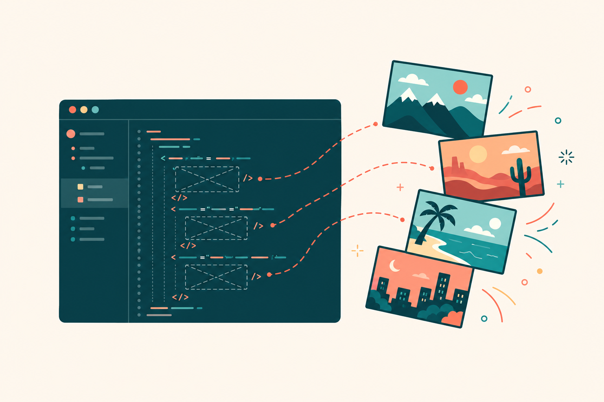

# imagegen — Claude Code plugin



[](https://github.com/colin-automates/Codex-ImageGen--Claude-Code/actions/workflows/ci.yml)
[](LICENSE)
[](https://github.com/colin-automates/Codex-ImageGen--Claude-Code/releases)

**Generate real images from inside Claude Code, with zero API costs.** The plugin delegates to OpenAI's [Codex CLI](https://developers.openai.com/codex/cli) and its built-in `gpt-image` tool — billed against your **ChatGPT subscription**, not the OpenAI API.

> 🎯 **The point**: once installed, Claude generates images **automatically** whenever your task involves one — websites, READMEs, blog posts, slide decks, game assets, app icons, marketing pages. No `/` commands needed. No "may I generate this?" prompts. The plugin's broad-trigger SKILL watches every conversation and fires when an actual rendered image (not a placeholder) would land better than a description.

Slash commands (`/imagegen "<prompt>"`, `/imagegen:edit`) are still there for explicit control — but the typical day-to-day flow is just *"build me a roofing company landing page"* and the images appear, wired into your HTML.

## Quick start

In any Claude Code workspace:

```
/plugin marketplace add github.com/colin-automates/Codex-ImageGen--Claude-Code
/plugin install imagegen@imagegen-marketplace
/imagegen:setup
```

`/imagegen:setup` auto-installs Codex CLI if it's missing, auto-launches a browser to sign into ChatGPT if you're not logged in, and runs a test image to confirm the pipeline. When it reports green, you're done — Claude will generate images on its own from there.

---

## How auto-activation actually feels

The headline feature. Once the plugin is installed, you don't think about it. Examples that fire it without any slash command:

| You say | What happens silently |
|---|---|
| *"build me a hiking-blog landing page"* | Claude scaffolds the HTML, then generates a hero photo, 3 service-section illustrations, and an OG image — all wired into the right `` slots. |
| *"add a banner to the README"* | A 1536×1024 hero image lands at `./docs/images/banner.png` and the README's empty image syntax is filled in. |
| *"I need a logo for a coffee app, flat vector, two-tone"* | One image generated; the prompt is interpreted style-aware. |
| *"generate enemy sprites: red, blue, green"* | Auto-routes to **set mode** — three coherent sprites in one Codex session, sharing palette/style. |
| *"redesign this slide deck"* | Empty hero slots in `.md`/marp/reveal.js decks get filled per-slide. |
| *"fix the broken `` in landing.html"* | Single image, saved next to the page, `src=""` rewritten with a real `alt`. |

**Trigger framing**: the skill is a *pre-flight check across any project type*, not a keyword matcher. Before Claude ships any build — websites, apps, games, CLIs, libraries, docs, decks, brand work — it asks "does any surface here need a generated image?" and fires the tool if yes. So **build-mode** requests trigger it even when you never say "image": *"build me a landing page for X"*, *"scaffold a SaaS app"*, *"build a platformer game"* (sprites + tiles + character art), *"set up a CLI tool"* (README hero + OG card), *"design a logo for Y"*, *"write a tutorial on Z"* (header + section illustrations). Same for explicit verbs (*"generate / create / make / build / draw / render / design / edit / redo"*) applied to images, websites, apps, games, libraries, decks, or any visual surface.

**Non-triggers** (intentionally narrow): SVG icons that match an *existing* icon set already wired into the project (lucide, heroicons, etc.), charts/graphs from real data, screenshots of running code, or anything you explicitly told Claude not to generate (*"no images"*, *"SVG only"*).

**Multi-image intent** auto-detects too: if your prompt has an explicit count ("three icons"), a comma/and list, pipe-separated parts, or set-keywords (*set / series / pack / roster*), Claude calls `generate_image_set` once instead of `generate_image` N times — keeps style consistent and uses fewer ChatGPT plan turns.

## Slash commands (for explicit control)

| Command | What it does |
|---|---|
| `/imagegen "<prompt>"` | Generate one image, or a coherent set if the prompt describes multiple. |
| `/imagegen setup` | One-time setup probe — installs Codex CLI if missing, auto-launches browser sign-in if needed. Same as `/imagegen:setup`. |
| `/imagegen:edit <path> <prompt>` | Edit an existing image with a natural-language instruction. |
| `/imagegen:img <prompt>` | Alias of `/imagegen`. |

```
/imagegen "a small flat-vector logo for a hiking startup, two-tone palette, mountain silhouette"
/imagegen "headers for four blog posts about hiking, climbing, kayaking, biking"
/imagegen:edit ./public/hero.png "make the sky look stormy"
```

## Requirements

- **Node.js 18+** with `npm` (Claude Code already needs this; nothing extra to install).
- An active **ChatGPT** subscription that includes Codex usage — Plus, Pro, Business, Edu, or Enterprise. (Free tier may also be eligible during current OpenAI promos — verify in your account.)
- **OpenAI Codex CLI** — installed automatically by `/imagegen:setup`. If you'd rather install it yourself, any of these work:
  - `npm install -g @openai/codex` (cross-platform, what setup uses)
  - `brew install openai/tap/codex` (macOS)
  - Download a binary from https://github.com/openai/codex/releases

## How it works

```
You type a prompt
    ↓
Claude Code (this app)
    ↓ calls MCP tool
imagegen MCP server (Node bundle in this repo)
    ↓ spawns `codex exec ...`
Codex CLI (uses your local auth at ~/.codex/auth.json)
    ↓ calls
OpenAI's gpt-image backend
    ↓ usage billed against...
Your ChatGPT subscription   ← (NOT your OpenAI API account)
```

The MCP server (TypeScript, in [plugins/imagegen/server/](plugins/imagegen/server/), bundled with esbuild to `dist/index.cjs`) shells out to:

```
codex exec --skip-git-repo-check --sandbox danger-full-access \
  --cd <workspace> --add-dir <save-dir> --output-last-message <tmp> \
  "@imagegen <your prompt>. Save to <abs save_path>. ..."
```

Codex generates the image, saves it to the requested path, and prints `SAVED <path>` in its final message. The MCP server parses that, falls back to scanning the parent dir for newly-created image files if needed, renames if Codex picked a different filename, and returns the path to Claude.

Because everything goes through Codex (not the OpenAI API directly), image generation is **billed against your ChatGPT plan limits, not your API key**. Confirm `$0` after running tests by checking [platform.openai.com/usage](https://platform.openai.com/usage).

## Caveats

- Image generation **burns Codex usage limits ~3-5× faster than text turns**. A six-image landing-page build can chew through a non-trivial chunk of a daily Codex quota.
- Calls take **30–90 seconds each**. A multi-image build will pause Claude for several minutes total — that's normal.
- Uses the Codex CLI under the hood — **not** the OpenAI API directly. No API key, no per-image dollar charges.
- Codex's `@imagegen` skill must be available in your Codex install. `/imagegen:setup` verifies this with a probe.

## Troubleshooting

### `Unknown command: /imagegen`

Try the namespaced colon form, which always works:

```
/imagegen:setup
/imagegen:edit ./path "<edit instructions>"
```

The bare `/imagegen "<prompt>"` form should also work in current Claude Code; if your version doesn't recognize it, fall back to `/imagegen:img "<prompt>"`.

### Claude pops a permission prompt before every tool call

The plugin ships a `settings.json` that pre-approves its three MCP tools. If your Claude Code version doesn't honor plugin-shipped settings, do **one** of:

1. Run `/permissions add mcp__plugin_imagegen_imagegen__*` once.
2. Copy these entries into `~/.claude/settings.local.json` (or your workspace's `.claude/settings.local.json`):
   ```json
   {
     "permissions": {
       "allow": [
         "mcp__plugin_imagegen_imagegen__generate_image",
         "mcp__plugin_imagegen_imagegen__edit_image",
         "mcp__plugin_imagegen_imagegen__generate_image_set"
       ]
     }
   }
   ```

### `/imagegen:setup` reports `codex_not_installed`

Setup tries to install Codex via `npm install -g @openai/codex` automatically. If that hits `EACCES` / "permission denied" (common on system-installed Node on macOS/Linux), run it manually:

```
sudo npm install -g @openai/codex   # macOS/Linux
```

Or open a terminal as Administrator on Windows. Then re-run `/imagegen setup`.

### `/imagegen:setup` reports `codex_not_authed`

Setup auto-launches a browser sign-in window and waits up to 3 minutes for OAuth to complete. Just complete the ChatGPT login in the browser tab that pops up; setup continues automatically. If the auto-launch doesn't work for any reason, fall back to `codex login` in any terminal, then re-run `/imagegen setup`.

### Transient OpenAI errors during generation

If you see `Reconnecting...` or `stream disconnected before completion` in the error output, OpenAI's gpt-image backend is having a transient issue (most common during peak hours). Wait 5–15 minutes and retry. Check [status.openai.com](https://status.openai.com) for ongoing incidents.

### `save_path_not_found` errors

The most likely cause: the `@imagegen` / gpt-image built-in tool isn't activated in your Codex install. Try:
- `codex --version` — should be a recent build.
- Run `/imagegen:setup` and read the report.

### `/plugin marketplace add` does nothing

If your repo path contains `;`, spaces, or other special characters, the slash-command parser may truncate it. Workaround: `cd` into the directory in your terminal, open Claude Code there, then run `/plugin marketplace add .` (just a dot).

For private GitHub repos, make sure your machine has the credentials (HTTPS token or SSH key) cached so `git clone <repo>` would succeed.

### Node version too old

The MCP server requires Node 18+. Check `node --version`. If too old, upgrade via nvm, fnm, or your OS package manager.

## Development

The MCP server source is in `plugins/imagegen/server/src/`. To rebuild the bundle:

```
cd plugins/imagegen/server
npm ci
npm test           # 48 tests, ~2s
npm run typecheck
npm run build      # produces dist/index.cjs (committed)
```

Source files:
- `index.ts` — MCP boot, three tool handlers, validation
- `schemas.ts` — zod schemas + JSON Schema for MCP tool definitions
- `codex.ts` — `codex exec` spawn, output capture, last-message parsing
- `prompts.ts` — three prompt templates (generate, edit, set)
- `poller.ts` — file-stable detection, mtime-scan fallback, rename-to-target
- `errors.ts` — error envelope + categorization

Tests live in `plugins/imagegen/server/test/`. CI re-runs `typecheck + test + build + git diff dist/` on every PR to catch stale bundle commits.

See [CONTRIBUTING.md](CONTRIBUTING.md) for the contribution flow.

## License

MIT — see [LICENSE](LICENSE).

## Credits

Built on [OpenAI Codex CLI](https://developers.openai.com/codex/cli) and the [Model Context Protocol SDK](https://modelcontextprotocol.io/). The hero image at the top of this README was generated by the plugin itself — meta-eating the dogfood.
